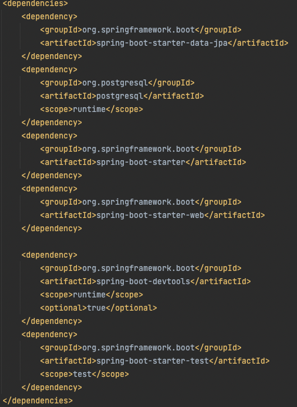
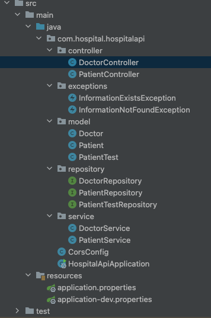
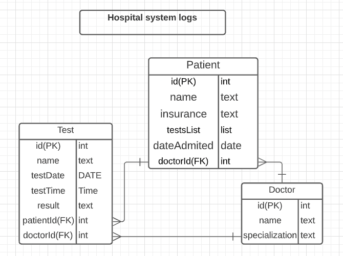

# Hospital System Registration

## GOAL

This project involved using a Spring Boot REST API for a Hospital Management System. It performs CRUD operations by making calls to PostgreSQL using Spring Data JPA(JAVA Persistence API). The system has proper functinality to register Doctors and Patients, assign doctors to each patient, assign tests to each patient, and add test/doctors. 

## Pom Dependencies
The dependency section contains the dependencies I added to the project namely Spring Data JPA, PostgreSQL driver, and SpringWeb.
- Pom.xml file dependencies

## Project Structure
1.  Controller: This package will house the LeagueController and TeamController for calling the right Service
2.  Exceptions: This package holds the custom exceptions
3.  Model: This package holds all the Entites classes
4.  Repository: This package holds the repositories for accessing Jpa interface and accessing the database
5.  Service: This package holds the business logic

## Entity Relationship Diagram (ERD):

## User Stories

| |
| --- |
|1. A patient can have many tests
|2. One doctor can have many patients
|3. As a user, I would like to view a list of doctors.
|4. As a user, I would like to add a doctor.
|5. As a user, I would like to assign a doctor to a patient.
|6. As a user, I would like to modify the tests results.
